# AWS Retail Analytics Data Lake: Evidence and Issues Report

## Document purpose

This document provides chronological implementation evidence for the AWS Retail Analytics Data Lake project completed on August 9, 2026, in a four-hour Pluralsight AWS sandbox. It combines build evidence, validation results, problems encountered, root causes, corrections, and lessons learned in one GitHub-ready report.

The screenshots are stored under `evidence/screenshots/` and use numbered filenames so they remain in chronological order in both Git and GitHub.

## Project outcome

The completed pipeline:

1. Preserved retail CSV source files in the Amazon S3 raw zone.
2. Used an AWS Glue Spark job to apply schemas, validate records, and detect duplicates and broken references.
3. Wrote valid records to the curated zone as Parquet with Snappy compression.
4. Wrote rejected records to a run-specific quarantine location with rejection reasons.
5. Registered five curated datasets through an AWS Glue crawler and the Glue Data Catalog.
6. Validated curated and gold data with Amazon Athena.
7. Created daily-sales and customer-360 reporting outputs.
8. Orchestrated the Glue job with an AWS Step Functions Standard workflow.
9. Corrected the workflow to use `StartJobRun.sync`, ensuring Step Functions waits for the Glue job's final status.

## Implemented data flow

```text
Retail CSV files
      |
      v
Amazon S3 raw/source=retail/entity=.../ingest_date=...
      |
      v
AWS Glue Spark ETL
      |------------------------------|
      v                              v
Valid rows                       Invalid rows
S3 curated zone                 S3 quarantine zone
Parquet/Snappy                   Parquet + reject_reason
      |
      v
Glue Crawler and Data Catalog
      |
      v
Amazon Athena validation and gold tables
      |
      v
daily_sales and customer_360

AWS Step Functions --StartJobRun.sync--> AWS Glue
        | success                              | failure
        v                                      v
PipelineSucceeded                       PipelineFailed
```

## Final validation summary

| Validation | Expected | Observed | Result |
|---|---:|---:|---|
| Curated customers | 5 | 5 | Passed |
| Curated products | 5 | 5 | Passed |
| Curated orders | 5 | 5 | Passed |
| Distinct order IDs | 5 | 5 | Passed |
| Curated order items | 7 | 7 | Passed |
| Curated order-status events | 8 | 8 | Passed |
| Total value of all orders | 655.00 | 655.00 | Passed |
| Non-cancelled revenue | 595.00 | 595.00 | Passed |
| Daily-sales reporting rows | 2 | 2 | Passed |
| Customer-360 reporting rows | 5 | 5 | Passed |
| Bad data isolated from curated reporting | Required | Quarantine objects created | Passed |
| Step Functions waits for Glue completion | Required | `.sync` option enabled and rerun completed | Passed |

## Chronological implementation evidence

### 01. Initial S3 source structure — 10:29 AM

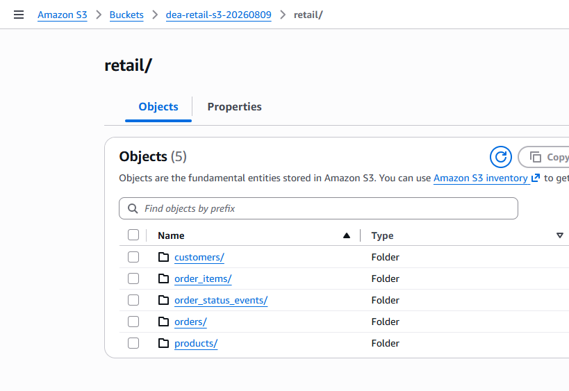

**What the screenshot shows:** The S3 bucket contained five source-entity folders under `retail/`: `customers`, `order_items`, `order_status_events`, `orders`, and `products`.

**Why this step mattered:** Separating source files by entity establishes a predictable ingestion contract and avoids mixing schemas.

**Important observation:** This was the initial layout, not the final layout expected by the Glue script. The required prefix was later corrected to `raw/source=retail/entity=<entity>/ingest_date=<date>/`.

**DEA-C01 relevance:** Data ingestion, S3 organization, prefixes, and partition-style naming.

---

### 02. Successful S3 file upload — 10:30 AM

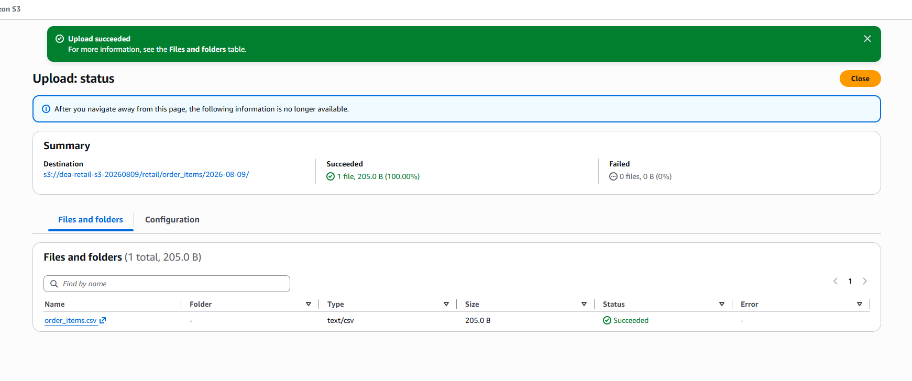

**What the screenshot shows:** The S3 console reported `Upload succeeded`, with no failed objects.

**Why this step mattered:** It confirmed that the sandbox identity had permission to write source data to the project bucket.

**Validation:** Upload status was successful and the object appeared at the selected destination.

---

### 03. Source files confirmed through CloudShell — 10:36 AM

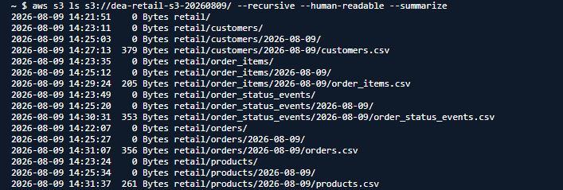

**What the screenshot shows:** `aws s3 ls --recursive --human-readable --summarize` listed all five CSV files in the original `retail/<entity>/2026-08-09/` structure.

**Why this step mattered:** CloudShell provided an independent CLI validation of the objects uploaded through the console.

**Issue discovered later:** The files existed, but their prefixes did not match the paths constructed by the Glue script. This distinction explains why an S3 object can be present while Spark still reports `PATH_NOT_FOUND`.

---

### 04. Glue service role created — 10:41 AM

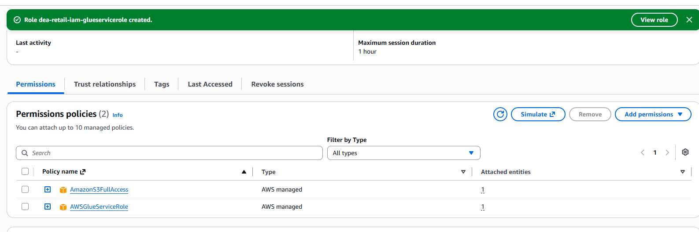

**What the screenshot shows:** The Glue service role was created with the AWS-managed `AWSGlueServiceRole` and `AmazonS3FullAccess` policies.

**Why this step mattered:** Glue required permission to read raw files, write curated and quarantine files, access Glue metadata, and publish operational logs.

**Security note:** `AmazonS3FullAccess` was acceptable for a short-lived restricted sandbox but is broader than a production role should be. A production role should restrict S3 actions to the project bucket and approved prefixes.

**DEA-C01 relevance:** IAM execution roles, service permissions, and least-privilege design.

---

### 05. Initial Glue job created — 10:53 AM

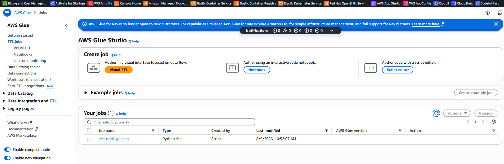

**What the screenshot shows:** The first Glue job was created as a Python Shell job.

**Issue:** The project script imports `pyspark` and AWS Glue Spark libraries. Python Shell does not provide the Spark runtime, which caused `ModuleNotFoundError: No module named 'pyspark'`.

**Correction:** The job was recreated or reconfigured as an AWS Glue Spark job using Python 3. The later successful Glue run confirms the corrected runtime.

**Lesson learned:** Selecting Python as the script language is not the same as selecting the Python Shell runtime. PySpark ETL requires a Spark-based Glue job.

---

### 06. Raw prefix corrected with CloudShell — 11:18 AM

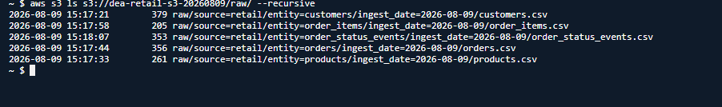

**What the screenshot shows:** All five source files were present under the structure expected by the Glue job:

```text
raw/source=retail/entity=customers/ingest_date=2026-08-09/customers.csv
raw/source=retail/entity=products/ingest_date=2026-08-09/products.csv
raw/source=retail/entity=orders/ingest_date=2026-08-09/orders.csv
raw/source=retail/entity=order_items/ingest_date=2026-08-09/order_items.csv
raw/source=retail/entity=order_status_events/ingest_date=2026-08-09/order_status_events.csv
```

**Issue resolved:** Spark previously searched for `s3://<bucket>/raw/source=retail/entity=customers/*/*.csv` and failed because the data was under `retail/customers/...`.

**Why this structure is useful:** `entity=` and `ingest_date=` provide self-describing, partition-style prefixes that support traceability and scalable batch organization.

---

### 07. Successful Glue Spark job run — 11:22 AM

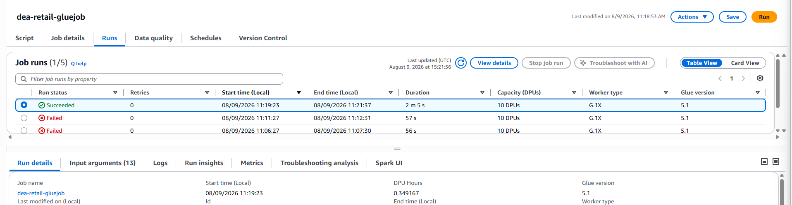

**What the screenshot shows:** The Glue Runs tab contains a successful run after earlier failed attempts.

**What this proves:** The corrected Spark runtime, job parameters, bucket value, and S3 paths allowed the full transformation to complete.

**Earlier failures represented useful troubleshooting evidence:**

- Missing `--BUCKET` or `--RUN_ID` arguments
- Supplying `s3://...` instead of the bucket name alone
- Incorrect raw-data prefix
- Initial Python Shell runtime

**Final parameter contract:**

```text
--BUCKET = dea-retail-s3-20260809
--RUN_ID = good-001 (or another unique run identifier)
```

The script adds `s3://` itself, so the `--BUCKET` value must contain only the bucket name.

---

### 08. Glue crawler created and completed — 11:28 AM

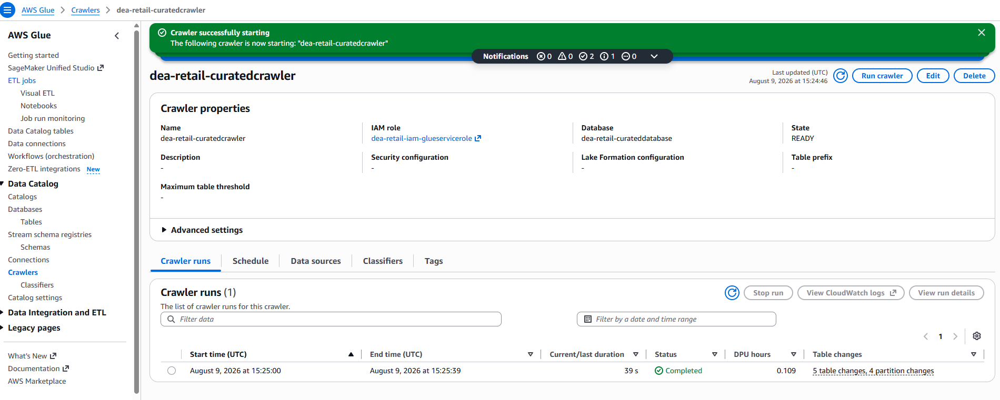

**What the screenshot shows:** The `dea-retail-curatedcrawler` crawler completed successfully, targeted the curated S3 data, and updated the `dea-retail-curateddatabase` Data Catalog database. Five tables were created or updated.

**What this proves:** The curated Parquet objects were readable and discoverable, and the crawler inferred schemas for Athena.

**DEA-C01 relevance:** Metadata discovery, Glue Data Catalog, crawler configuration, and schema management.

---

### 09. Curated database validated in Athena — 11:39 AM

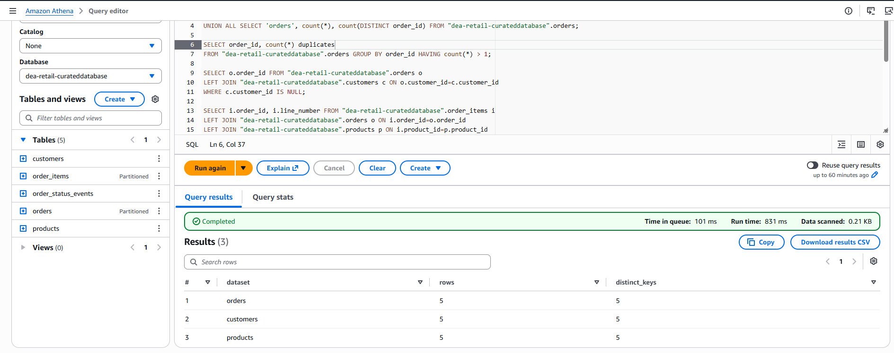

**What the screenshot shows:** Athena displayed the five curated tables and returned validation results for the curated entities.

**What this proves:** The crawler registered the expected datasets and Athena could query them through the Glue Data Catalog.

**Naming lesson:** Because the database name contains hyphens, qualified Athena references must quote it:

```sql
SELECT *
FROM "dea-retail-curateddatabase".orders;
```

Using `dea_retail_curateddatabase` or leaving the hyphenated name unquoted refers to a different or invalid schema.

---

### 10. Good-batch totals validated — 11:41 AM

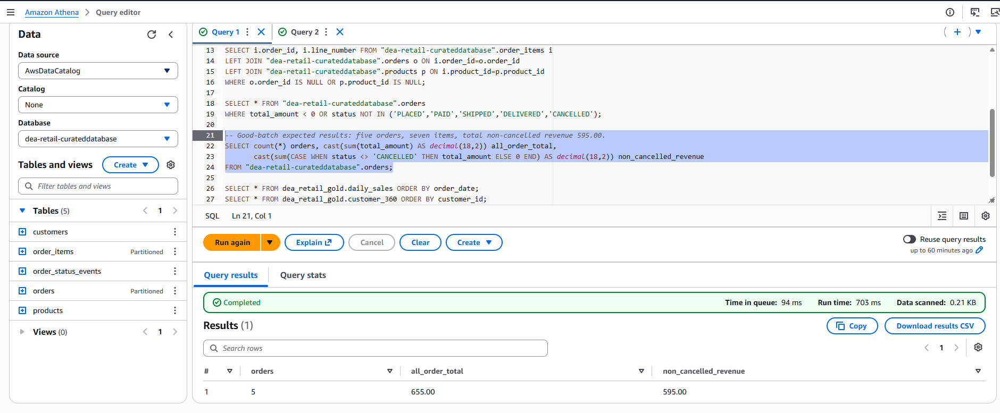

**What the screenshot shows:** The curated orders validation returned:

| Metric | Observed value |
|---|---:|
| Orders | 5 |
| Total value of all orders | 655.00 |
| Non-cancelled revenue | 595.00 |

**What this proves:** The curated layer preserved valid source totals and correctly excluded the cancelled order from reportable revenue.

**Validation principle:** Row counts alone are insufficient. Financial pipelines should also reconcile distinct business keys and monetary totals.

---

### 11. Gold daily-sales table validated — 11:57 AM

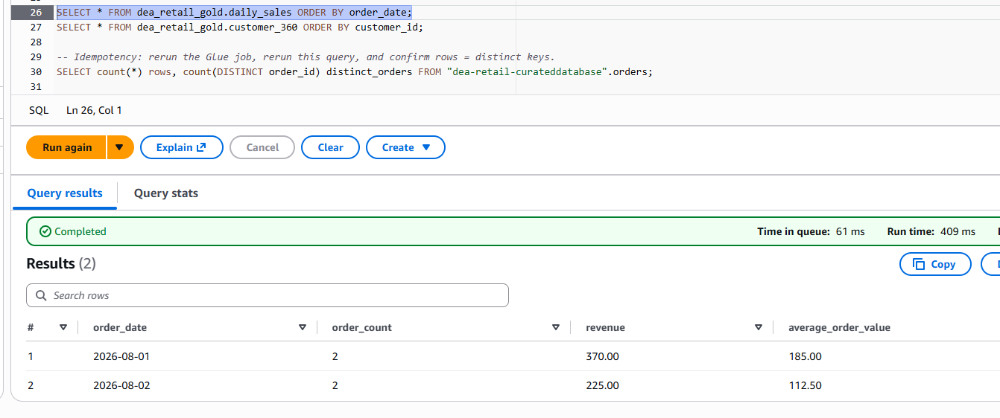

**What the screenshot shows:** Athena returned two reporting rows from the daily-sales gold table:

| Order date | Order count | Revenue | Average order value |
|---|---:|---:|---:|
| 2026-08-01 | 2 | 370.00 | 185.00 |
| 2026-08-02 | 2 | 225.00 | 112.50 |

**What this proves:** The gold transformation grouped orders by date, excluded cancelled orders, and calculated the expected business measures.

**DEA-C01 relevance:** Athena CTAS, aggregation, Parquet output, and validation of business transformations.

---

### 12. Gold customer-360 table validated — 11:57 AM

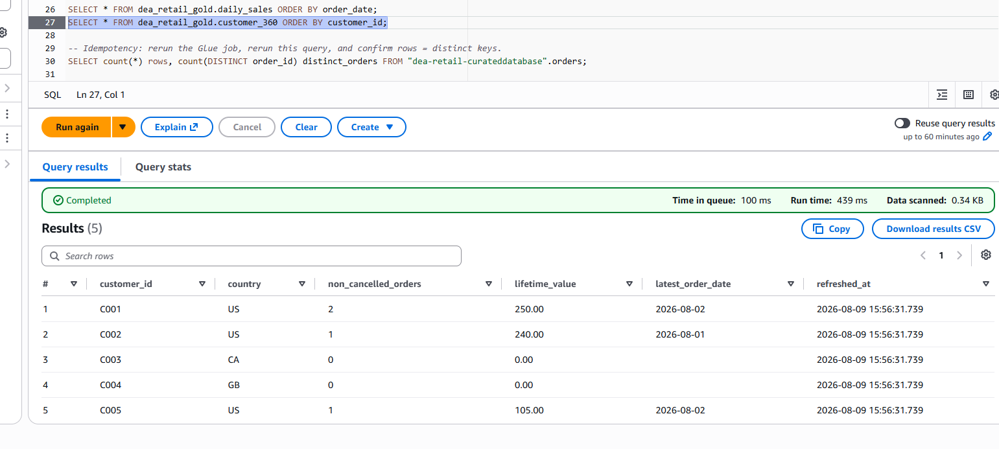

**What the screenshot shows:** Athena returned five customers with country, non-cancelled order count, lifetime value, latest order date, and refresh timestamp.

**Observed examples:**

- `C001`: two non-cancelled orders and lifetime value of 250.00
- `C002`: one non-cancelled order and lifetime value of 240.00
- `C003` and `C004`: zero qualifying orders and lifetime value of 0.00
- `C005`: one non-cancelled order and lifetime value of 105.00

**What this proves:** The left join retained customers without qualifying orders while correctly calculating customer-level measures.

---

### 13. Deliberately bad data uploaded — 12:06 PM

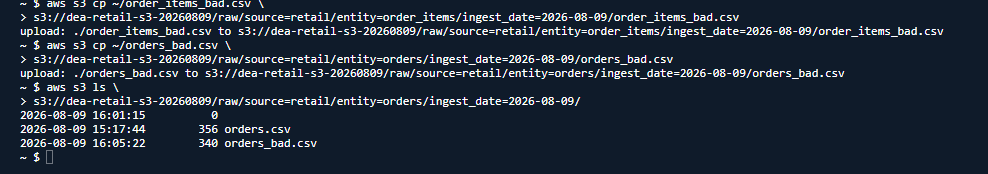

**What the screenshot shows:** CloudShell copied `orders_bad.csv` and `order_items_bad.csv` into the matching raw entity/date prefixes and listed the resulting order objects.

**Why this step mattered:** A controlled negative test demonstrates that the pipeline rejects bad rows rather than merely succeeding with good data.

**Examples of injected defects:**

- Duplicate or blank order IDs
- Unknown customer and product references
- Invalid order status
- Negative order total
- Non-positive item quantity or unit price
- Item referencing an unknown or invalid order

---

### 14. Glue run completed with mixed good and bad input — 12:11 PM

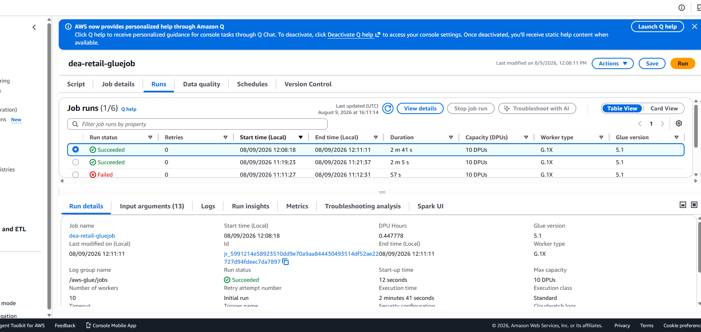

**What the screenshot shows:** The Glue job completed successfully after the bad files were added.

**Interpretation:** A data-quality rejection is not necessarily a technical job failure. The intended behavior is to complete the batch, publish valid records, and route rejected records to quarantine.

**What this proves:** The pipeline distinguishes infrastructure or code failure from record-level quality failure.

---

### 15. Curated Parquet output confirmed — 12:13 PM

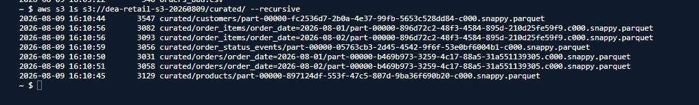

**What the screenshot shows:** CloudShell listed Snappy-compressed Parquet objects for customers, products, orders, order items, and order-status events. Orders and order items were organized under `order_date` partition prefixes.

**What this proves:** The CSV-to-Parquet conversion succeeded and all five curated entities were produced.

**Performance significance:** Parquet columnar storage, compression, and partition pruning reduce Athena data scanning compared with querying raw CSV files.

---

### 16. Quarantine output confirmed — 12:14 PM

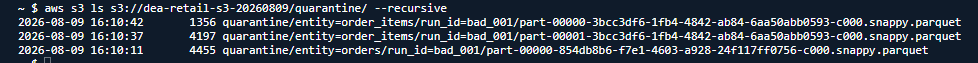

**What the screenshot shows:** CloudShell listed quarantine Parquet objects for invalid orders and order items under a bad-data run ID.

**What this proves:** Rejected records were physically separated from curated data and remained available for investigation and correction.

**Traceability:** The `run_id` prefix links quarantine records to a specific processing attempt, supporting audit, troubleshooting, and replay.

---

### 17. Step Functions workflow created — 12:47 PM

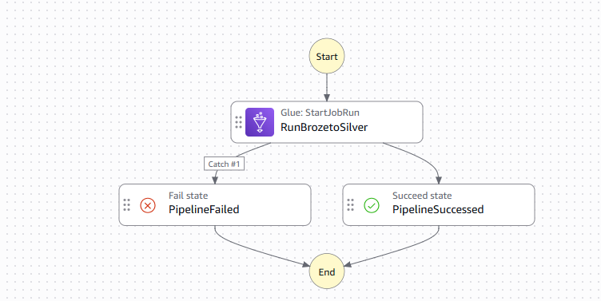

**What the screenshot shows:** The visual workflow contains:

- Glue `StartJobRun` task: `RunBrozetoSilver`
- Normal success route: `PipelineSucceeded`
- `Catch #1` failure route: `PipelineFailed`

**Error-handling configuration:** The catcher uses `States.ALL` and routes any unhandled Glue task error to the Fail state.

**What this proves:** The pipeline has explicit operational outcomes instead of silently ending after an error.

---

### 18. Initial Step Functions execution exposed an asynchronous design issue — 12:52 PM

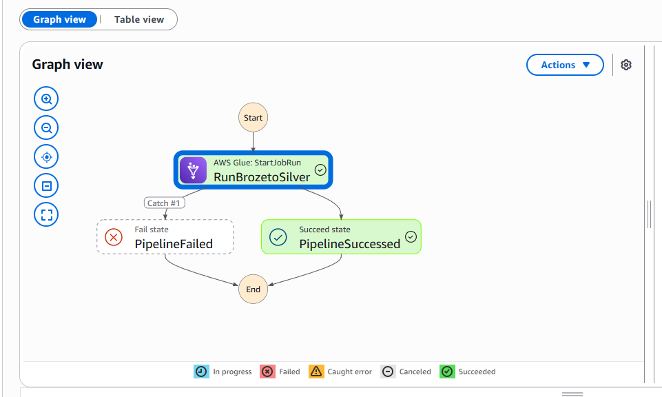

**What the screenshot shows:** The workflow moved to `PipelineSucceeded` immediately after starting the Glue job.

**Issue:** The Glue job was still running, but Step Functions had already reported success.

**Root cause:** The task used the request-response integration. `StartJobRun` successfully returned a Job Run ID, so Step Functions considered the task complete without waiting for Glue's final status.

**Risk:** Downstream jobs or reports could begin before the curated data was ready, and a later Glue failure would not change the already-successful Step Functions execution.

---

### 19. Synchronous wait option enabled — 12:56 PM

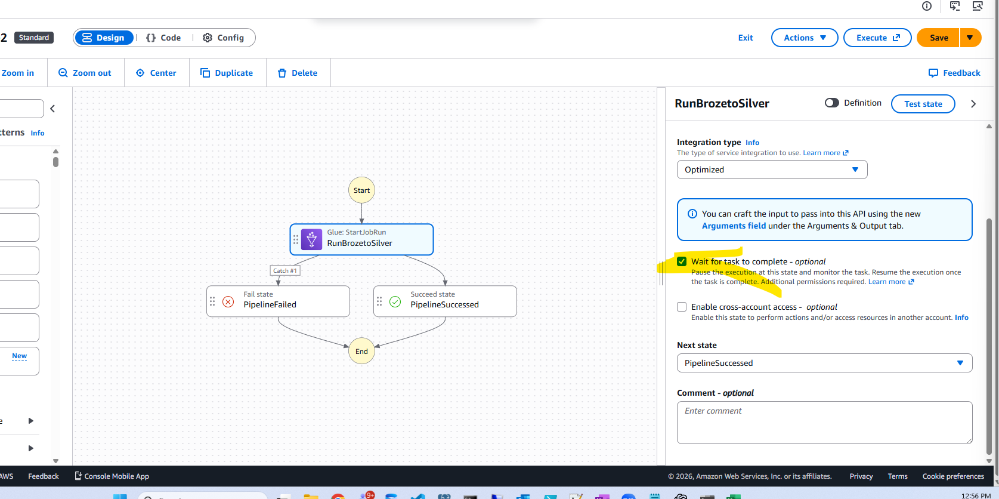

**What the screenshot shows:** `Wait for task to complete` was selected in the optimized Glue integration configuration.

**Resulting Amazon States Language resource:**

```json
"Resource": "arn:aws:states:::glue:startJobRun.sync"
```

**Why this correction mattered:** The `.sync` integration polls the Glue job and keeps the task running until Glue reaches a terminal state.

**Workflow requirement:** Job-run `.sync` integrations require a Step Functions Standard workflow; Express workflows do not support this pattern.

---

### 20. Corrected synchronous Step Functions execution — 1:04 PM

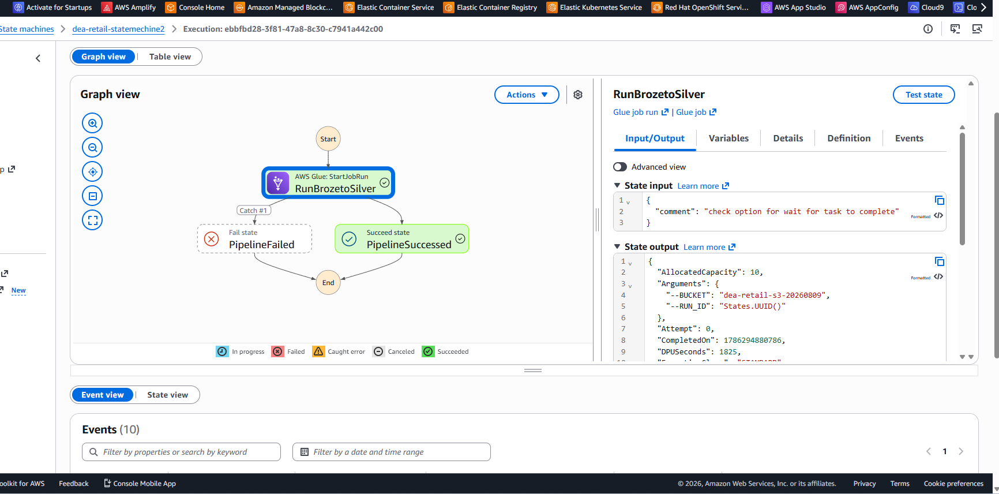

**What the screenshot shows:** The workflow was executed again after enabling synchronous waiting. `RunBrozetoSilver` completed before the workflow moved to `PipelineSucceeded`, and the state output contained Glue job-run information.

**What this proves:** The orchestration now represents the true end-to-end pipeline outcome:

- Glue `SUCCEEDED` leads to `PipelineSucceeded`.
- Glue `FAILED`, `TIMEOUT`, or `STOPPED` is caught and leads to `PipelineFailed`.

**Final orchestration status:** Corrected and validated.

## Issues encountered and resolutions

| ID | Symptom or error | Root cause | Resolution | Engineering lesson |
|---|---|---|---|---|
| 1 | `ModuleNotFoundError: No module named 'pyspark'` | Job was created as Python Shell. | Use an AWS Glue Spark job with Python 3. | Runtime selection determines whether Spark libraries and executors are available. |
| 2 | `GlueArgumentError` for `--BUCKET` and `--RUN_ID` | Required arguments were missing or named incorrectly. | Add uppercase `--BUCKET` and `--RUN_ID`; Glue supplies `--JOB_NAME`. | Parameter names are case-sensitive and form part of the job's interface contract. |
| 3 | `Illegal character in authority` for an S3 URI | `--BUCKET` included `s3://`, while the script also added the scheme. | Pass only `dea-retail-s3-20260809`, with no scheme or slash. | Clearly define whether parameters accept resource names, URIs, or ARNs. |
| 4 | Spark `PATH_NOT_FOUND` | Source files were under `retail/<entity>/<date>` instead of the scripted raw prefix. | Copy files to `raw/source=retail/entity=<entity>/ingest_date=<date>/`. | Validate the physical storage contract before running ETL. |
| 5 | Athena schema not found | The query used a different database spelling or an unquoted hyphenated name. | Use `"dea-retail-curateddatabase".<table>` or select the database in Athena. | Catalog identifiers with special characters must be quoted exactly. |
| 6 | Athena reported only one SQL statement is allowed | Multiple `DROP` and `CREATE TABLE AS SELECT` statements were submitted together. | Run each statement separately. | Athena query executions accept one SQL statement at a time. |
| 7 | `Unsupported Hive type: timestamp(3) with time zone` | `current_timestamp` produced a type unsupported by the target Hive table definition. | Omit the column or explicitly convert it to a supported timestamp representation. | Confirm engine-to-catalog type compatibility in CTAS operations. |
| 8 | SQL parser reported mismatched `AS` | A nested cast or alias expression was malformed during timestamp correction. | Simplify the select expression and apply one valid cast before the alias. | Make one change at a time and validate simplified CTAS SQL. |
| 9 | Gold database not found | `dea_retail_gold` had not yet been created. | Run `CREATE DATABASE dea_retail_gold` first. | A Data Catalog namespace must exist before creating qualified tables. |
| 10 | `HIVE_PATH_ALREADY_EXISTS` | A failed CTAS attempt left files at the external S3 location. Dropping a catalog table did not delete those files. | Use a new empty prefix or remove only the exact failed-attempt prefix after verifying it. | Table metadata lifecycle and S3 object lifecycle are independent. |
| 11 | Step Functions validation: `Catch[0]/ErrorEquals` empty | A catcher was drawn but no error name was selected. | Set `ErrorEquals` to `States.ALL` and fallback to `PipelineFailed`. | A visual transition is not complete until its catcher rule is configured. |
| 12 | Pipeline succeeded while Glue was still running | Task used request-response instead of job-run integration. | Enable `Wait for task to complete` / `glue:startJobRun.sync`. | Orchestration success must represent completion of the underlying workload, not API acceptance. |

## Validation approach

The project used several complementary validation methods:

### Storage validation

- Used the S3 console to confirm upload success.
- Used `aws s3 ls --recursive` to verify exact keys and output objects.
- Confirmed Parquet objects in curated and quarantine prefixes.

### Metadata validation

- Confirmed that the Glue crawler completed.
- Confirmed five curated tables in `dea-retail-curateddatabase`.
- Queried the cataloged tables through Athena.

### Data reconciliation

- Compared source and curated entity counts.
- Compared order count with distinct order ID count.
- Reconciled all-order total to 655.00.
- Reconciled non-cancelled revenue to 595.00.
- Validated daily-sales and customer-360 outputs against known expected results.

### Negative testing

- Added records with duplicate, missing, invalid, negative, and unknown-reference values.
- Reran the same pipeline with a separate run ID.
- Confirmed rejected records appeared in quarantine.
- Confirmed valid curated/reporting outcomes remained protected.

### Orchestration validation

- Confirmed the normal transition reaches `PipelineSucceeded`.
- Configured `States.ALL` to route task errors to `PipelineFailed`.
- Identified the false-success behavior of asynchronous `StartJobRun`.
- Enabled `.sync` and confirmed the corrected execution waited for Glue completion.

## Security, operational, and production observations

- The screenshots may contain sandbox resource names and execution identifiers, but no access keys or secret keys should be committed.
- The sandbox Glue role used `AmazonS3FullAccess`; production should use bucket- and prefix-scoped permissions.
- S3 Block Public Access should remain enabled.
- Production raw data should use encryption, retention, and lifecycle policies aligned with business requirements.
- CloudWatch logging and alarms should notify operators of Glue or Step Functions failures.
- A production pipeline should store batch status, input checksums, row counts, and completion status in a control table.
- The lab uses overwrite mode for curated data. A production incremental design should use partition-aware writes or an Apache Iceberg `MERGE` strategy.
- Quarantine records should have an ownership and remediation process, not merely a storage location.

## Suggested additional evidence for a future iteration

The current evidence demonstrates the core pipeline successfully. A future version could add:

1. A deliberately failed Step Functions execution showing the Catch route reaching `PipelineFailed`.
2. CloudWatch Glue error logs and a successful-run log excerpt.
3. Athena query statistics comparing CSV and Parquet bytes scanned.
4. Glue Data Catalog column and partition details.
5. An IAM least-privilege policy simulation.
6. EventBridge scheduling and SNS failure notification evidence.
7. A control-table record proving duplicate batch detection and idempotency.
