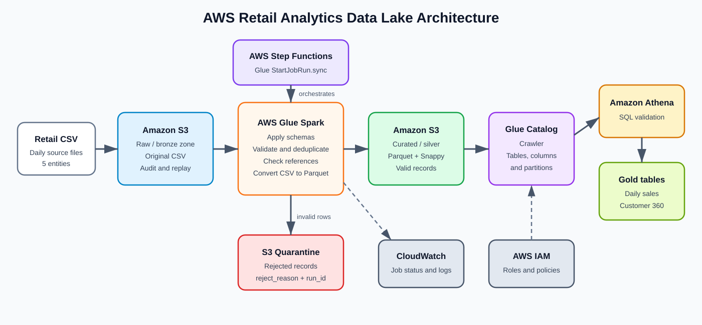
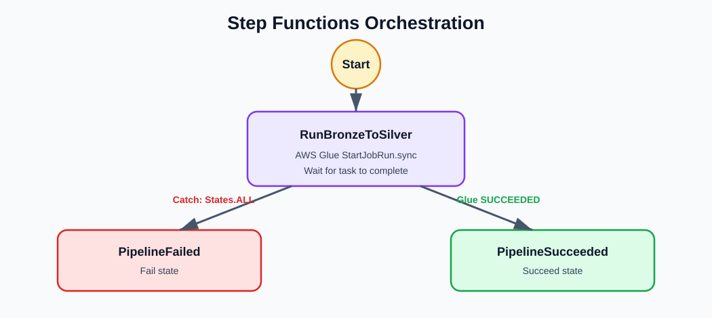
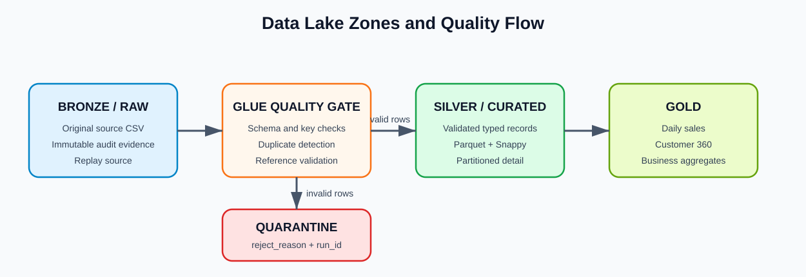
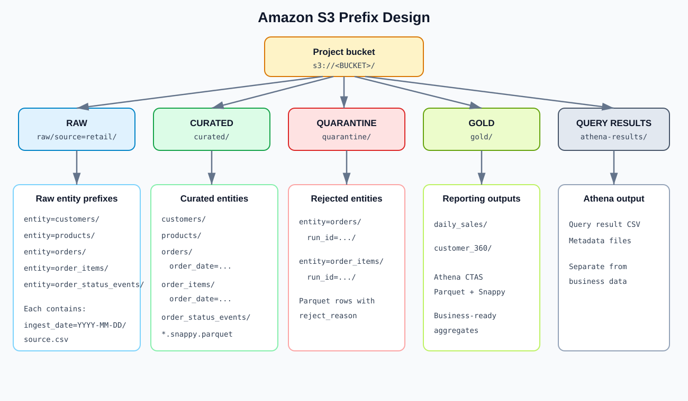

# AWS Retail Analytics Data Lake

A beginner-to-intermediate AWS data engineering portfolio project built in a four-hour Pluralsight AWS sandbox. It demonstrates batch ingestion, data quality, transformation, cataloging, serverless SQL analytics, orchestration, failure handling, and safe reprocessing.

## Project summary

A retail company receives daily CSV extracts containing:

- Customers
- Products
- Orders
- Order items
- Order-status events

The pipeline preserves the original files in Amazon S3, then uses an AWS Glue Spark job to validate and transform them. Valid rows are converted to compressed Parquet and written to the curated zone. Invalid or duplicate rows are isolated in a quarantine zone with a rejection reason. AWS Glue Data Catalog makes the curated datasets discoverable, and Amazon Athena validates the results and creates reporting-ready gold tables.

AWS Step Functions runs the Glue job synchronously, routes successful runs to a `Succeed` state, and catches failures so they reach a `Fail` state.

## Business objective

The platform must:

- Preserve original source files for audit and replay.
- Detect invalid, duplicate, and referential-integrity failures.
- Prevent rejected data from reaching analytics tables.
- Convert CSV into query-efficient Parquet with Snappy compression.
- Support daily sales and customer analytics.
- Make a failed or repeated batch safe to process again.
- Provide observable success and failure paths.

## AWS services used

| AWS service | Purpose in this project |
|---|---|
| Amazon S3 | Stores raw, curated, quarantine, gold, scripts, and Athena results. |
| AWS Glue ETL | Runs the PySpark validation and CSV-to-Parquet transformation. |
| AWS Glue Crawler | Discovers curated files and updates table metadata. |
| AWS Glue Data Catalog | Stores database, table, column, and partition metadata. |
| Amazon Athena | Validates curated data and builds gold reporting tables with CTAS. |
| AWS Step Functions | Orchestrates the Glue job, waits for completion, and handles failures. |
| AWS IAM | Gives Glue and Step Functions least-privilege access to required resources. |
| Amazon CloudWatch | Stores Glue and Step Functions execution logs for troubleshooting. |

## Architecture


### Orchestration flow


The `.sync` integration is important: Step Functions waits for the actual Glue job to finish instead of treating a successful `StartJobRun` API call as pipeline completion.

## Data lake zones

This project uses the medallion pattern, with a separate quarantine path for rejected data.


| Zone | S3 prefix | Format | Purpose |
|---|---|---|---|
| Bronze/raw | `raw/source=retail/` | CSV | Retains the source exactly as received and supports replay. |
| Silver/curated | `curated/` | Parquet/Snappy | Stores validated, typed, query-efficient detail data. |
| Quarantine | `quarantine/` | Parquet | Isolates rejected records and records why they failed. |
| Gold | `gold/` | Parquet/Snappy | Stores business-facing aggregates produced by Athena. |
| Query results | `athena-results/` | Athena output | Stores Athena query execution results. |

## S3 design

Replace `<BUCKET>` with your globally unique bucket name.

```text
s3://<BUCKET>/
|-- raw/
|   `-- source=retail/
|       |-- entity=customers/ingest_date=YYYY-MM-DD/customers.csv
|       |-- entity=products/ingest_date=YYYY-MM-DD/products.csv
|       |-- entity=orders/ingest_date=YYYY-MM-DD/orders.csv
|       |-- entity=order_items/ingest_date=YYYY-MM-DD/order_items.csv
|       `-- entity=order_status_events/ingest_date=YYYY-MM-DD/order_status_events.csv
|-- curated/
|   |-- customers/
|   |-- products/
|   |-- orders/order_date=YYYY-MM-DD/
|   |-- order_items/order_date=YYYY-MM-DD/
|   `-- order_status_events/
|-- quarantine/
|   |-- entity=orders/run_id=<RUN_ID>/
|   `-- entity=order_items/run_id=<RUN_ID>/
|-- gold/
|   |-- daily_sales/
|   `-- customer_360/
|-- scripts/
`-- athena-results/
```


Partitioning the raw files by ingestion date supports batch traceability. Curated orders and order items are partitioned by business `order_date`, which supports efficient date-filtered Athena queries.

## Data-quality rules

The Glue job applies explicit schemas and checks:

| Entity | Example validations |
|---|---|
| Customers | Customer ID is present, email contains `@`, and country is present. |
| Products | Product ID is present, price is positive, and category is present. |
| Orders | Order ID is present and unique; customer exists; status is allowed; total is non-negative; date is valid. |
| Order items | Referenced order and product exist; line number is present; quantity and price are positive. |
| Status events | Referenced order exists and status is allowed. |

Rejected rows include a `reject_reason`, such as `DUPLICATE_ORDER_ID`, `UNKNOWN_CUSTOMER`, `INVALID_STATUS`, `NEGATIVE_TOTAL`, `UNKNOWN_PRODUCT`, or `NON_POSITIVE_QUANTITY`.

## Repository contents

```text
aws-dea-retail-lakehouse/
|-- data/
|   |-- good/                         # Valid sample CSV files
|   `-- bad/                          # Deliberately invalid test records
|--                              # Console guide, runbook, exam map, and learning plan
|-- evidence/                         # Templates for results and screenshots
|-- glue/
|   |-- retail_bronze_to_silver.py    # Main Glue PySpark job
|   `-- orders_ruleset.dqdl           # Optional Glue Data Quality rules
|-- iam/                              # Example Glue and Step Functions policies
|-- orchestration/                    # Step Functions ASL definitions
|-- sql/
|   |-- 01_create_gold.sql            # Athena gold-table CTAS statements
|   `-- 02_validation.sql             # Validation queries
`-- README.md
```

## Four-hour build sequence

1. **Create the S3 bucket and prefixes** — establishes storage zones and keeps data organized by processing stage.
2. **Upload the five good CSV files** — creates a known-good baseline for the first pipeline run.
3. **Create the Glue IAM role** — authorizes Glue to read and write the project bucket and publish logs.
4. **Create a Glue Spark job** — runs `glue/retail_bronze_to_silver.py` with Python 3 and Spark.
5. **Add Glue job parameters** — pass `--BUCKET=<BUCKET>` and `--RUN_ID=good-001`; Glue supplies `--JOB_NAME` automatically.
6. **Run the Glue job** — writes valid data to curated Parquet and any invalid rows to quarantine.
7. **Create and run a Glue crawler** — registers the curated datasets in the Glue Data Catalog.
8. **Query the tables in Athena** — verifies counts, totals, schemas, partitions, and data quality.
9. **Create the gold database and tables** — runs each statement in `sql/01_create_gold.sql` separately because Athena accepts one statement per execution.
10. **Create a Standard Step Functions workflow** — uses `glue:startJobRun.sync`, a `States.ALL` catcher, and separate success/failure terminal states.
11. **Upload and process the bad-data files** — proves invalid data is quarantined and does not contaminate curated results.
12. **Capture evidence and clean up** — records results for the portfolio and removes sandbox resources if required.

The detailed console instructions are in [00-pluralsight-4-hour-sprint.md](00-pluralsight-4-hour-sprint.md).

## Glue job parameters

| Parameter | Example | Meaning |
|---|---|---|
| `--BUCKET` | `dea-retail-example-20260809` | Bucket name only; do not include `s3://` or a trailing slash. |
| `--RUN_ID` | `good-001` | Identifies the processing attempt and separates quarantine output. |
| `--JOB_NAME` | Supplied by Glue | Used by the Glue job initialization code. |

```

## Reprocessing behavior

- Raw files remain available so a batch can be replayed.
- Curated datasets use overwrite mode, preventing repeated runs from appending duplicate copies of the same source data.
- Duplicate order IDs are rejected during validation.
- Quarantine output is separated by `RUN_ID`, making each processing attempt traceable.
- Step Functions waits for Glue completion and exposes the pipeline's true success or failure status.

For a production implementation, replace full-dataset overwrite with incremental partition writes or an Apache Iceberg merge strategy, and store batch metadata in a control table.


## Skills demonstrated

- Designing S3 data lake zones and partition paths
- Developing AWS Glue PySpark ETL
- Applying schema, quality, duplicate, and referential-integrity checks
- Converting CSV to Parquet with Snappy compression
- Cataloging data and querying it with Athena
- Building gold reporting tables with CTAS
- Orchestrating synchronous Glue jobs with Step Functions
- Implementing retry, catch, success, and failure behavior
- Validating data from source through reporting outputs
- Designing for auditability, idempotency, security, and cost control


This project is intentionally small, but AWS services can still incur charges outside a sandbox. Delete or stop temporary resources after completing the lab, including Glue jobs and crawlers, Step Functions executions, CloudWatch log groups, Athena output, and project S3 objects. Never leave optional Aurora, DMS, Redshift, or streaming resources running solely for portfolio evidence.
